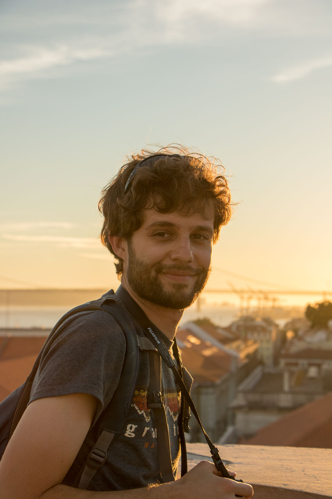

# Resume

I am an an associate professor at [INSA Rennes], with a joint appointment at the [IETR] laboratory.
My current research efforts concentrates on compilation for MPSoC and
FPGA.
I am interested in embedded systems programming, compilation and hardware
architecture.

I received the Engineering and Master degrees in Electrical Engineering from
[Polytech'Orléans], France, in 2011,
and the Ph.D.  degree in Computer Science from [INSA Lyon], France, in
2014, working with the [CITI-Inria] laboratory in collaboration with
[CEA LETI].
I previously worked at [Nokia] in Berkeley, California,
[National Instruments] in Austin, Texas
and [IRISA] laboratory in Rennes, France.

[Nokia]: https://www.nokia.com/en_int
[Polytech'Orléans]: http://www.univ-orleans.fr/polytech/
[INSA Lyon]: http://www.insa-lyon.fr/en/
[CITI-Inria]: http://www.citi-lab.fr/en_UK/
[CEA LETI]: http://www-leti.cea.fr/en/
[National Instruments]: https://www.ni.com/
[IRISA]: https://www.irisa.fr/en
[ARGO European project]: http://www.argo-project.eu/
[INSA Rennes]: https://www.insa-rennes.fr/en.html
[IETR]: https://www.ietr.fr/?lang=en

# Selected Publications

For a full list of publications, see [publications](publications).

- [Reconciling Compiler Optimizations and WCET Estimation Using Iterative Compilation](https://hal.archives-ouvertes.fr/hal-02286164). 
**Mickaël Dardaillon**, Stefanos Skalistis, Isabelle Puaut and Steven Derrien 
	in Real Time Systems Symposium (RTSS), Hong Kong, China, December 2019.
- [A new compilation flow for software-defined radio applications on heterogeneous MPSoCs](https://hal.inria.fr/hal-01396143). 
  **Mickaël Dardaillon**, [Kevin Marquet], [Tanguy Risset], Jérôme Martin and
  [Henri-Pierre Charles] 
  in ACM Transactions on Architecture and Code Optimization (TACO), vol.
  13, no. 2, June 2016.
- [Adaptive Digital Pre-distortion for Future Wireless Transmitters](http://dx.doi.org/10.1109/ICECS.2015.7440316). 
   **Mickaël Dardaillon**, [Chadi Jabbour] and [Vason Srini] 
   in IEEE International Conference on Electronics, Circuits, and Systems. Cairo, Egypt, December 2015.
- [Compilation d'applications flot de données paramétriques pour MPSoC dédiés à
  la radio logicielle](http://www.theses.fr/2014ISAL0102/document). 
  **Mickaël Dardaillon** at INSA Lyon, France, November 2014.
- [A Compilation Flow for Parametric Dataflow: Programming Model, Scheduling,
   and Application to Heterogeneous MPSoC](https://hal.inria.fr/hal-01048649). 
   **Mickaël Dardaillon**, [Kevin Marquet], [Tanguy Risset], Jérôme Martin and
   [Henri-Pierre Charles] 
   in International Conference on Compilers, Architecture and Synthesis for Embedded Systems (CASES), New Dehli, India, October 2014.

[Kevin Marquet]: http://perso.citi-lab.fr/kmarquet/
[Tanguy Risset]: http://perso.citi.insa-lyon.fr/trisset/
[Henri-Pierre Charles]: http://henripierre.charles.free.fr/
[Cedric Lauradoux]: http://planete.inrialpes.fr/~lauradou/
[Chadi Jabbour]: http://www.researchgate.net/profile/Chadi_Jabbour/
[Isabelle Puaut]: https://team.inria.fr/pacap/members/isabelle-puaut/
[Vason Srini]: http://www.researchgate.net/profile/Vason_Srini2/

# Miscellaneous

Most of my free time is spent outside, either high up in the mountains
or deep down freediving, and I usually carry a camera:

