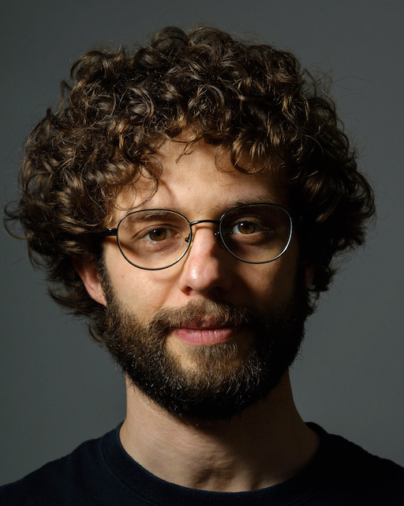

# Resume

I am an an associate professor at [INSA Rennes], with a joint appointment at the [IETR] laboratory.
My current research efforts concentrates on compilation for MPSoC and
FPGA.
I am interested in embedded systems programming, compilation and hardware
architecture.

I received the Engineering and Master degrees in Electrical Engineering from
[Polytech'Orléans], France, in 2011,
and the Ph.D.  degree in Computer Science from [INSA Lyon], France, in
2014, working with the [CITI-Inria] laboratory in collaboration with
[CEA LETI].
I previously worked at [Nokia] in Berkeley, California,
[National Instruments] in Austin, Texas
and [IRISA] laboratory in Rennes, France.

[Nokia]: https://www.nokia.com/en_int
[Polytech'Orléans]: http://www.univ-orleans.fr/polytech/
[INSA Lyon]: http://www.insa-lyon.fr/en/
[CITI-Inria]: http://www.citi-lab.fr/en_UK/
[CEA LETI]: http://www-leti.cea.fr/en/
[National Instruments]: https://www.ni.com/
[IRISA]: https://www.irisa.fr/en
[ARGO European project]: http://www.argo-project.eu/
[INSA Rennes]: https://www.insa-rennes.fr/en.html
[IETR]: https://www.ietr.fr/?lang=en

# Selected Publications

For a full list of publications, see [publications](publications).

- *Quentin Milot*, **Mickaël Dardaillon**, Justine Bonnot, Daniel Ménard,
"[Wordlength Optimization for Custom Floating-point Systems](https://hal.science/hal-04457903/)",
in Conference on Design & Architectures for Signal & Image Processing (DASIP), Munich, Germany, Jan. 2024.

- Alexandre Honorat, **Mickaël Dardaillon**, Hugo Miomandre, Jean-François Nezan,
"[Automated Buffer Sizing of Dataflow Applications in a High-Level Synthesis Workflow](https://hal.science/hal-04237266)",
in ACM Transactions on Reconfigurable Technology and Systems (TRETS), Sep. 2023.

- Karol Desnos, Thomas Bourgoin, **Mickaël Dardaillon**, Nicolas Sourbier, Olivier Gesny, Maxime Pelcat,
  "[Ultra-Fast Machine Learning Inference through C Code Generation for Tangled Program Graphs](https://hal.archives-ouvertes.fr/hal-03845227/)",
  in IEEE Workshop on Signal Processing Systems (SiPS), Rennes, France, Nov. 2022.

- *Pedro Ciambra*, **Mickaël Dardaillon**, Maxime Pelcat, Hervé Yviquel,
  "[Co-optimizing Dataflow Graphs and Actors with MLIR](https://hal.archives-ouvertes.fr/hal-03845902)",
  in IEEE Workshop on Signal Processing Systems (SiPS), Rennes, France, Nov. 2022.

- **Mickaël Dardaillon**, Stefanos Skalistis, Isabelle Puaut, Steven Derrien,
  "[Reconciling Compiler Optimizations and WCET Estimation Using Iterative Compilation](https://hal.archives-ouvertes.fr/hal-02286164)",
  in Real Time Systems Symposium (RTSS), Hong Kong, China, Dec. 2019.

# Miscellaneous

Most of my free time is spent outside, either high up in the mountains
or deep down freediving, and I usually carry a camera:

