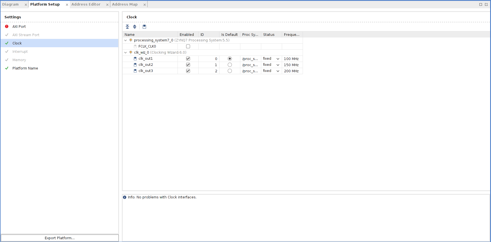

In this tutorial, we will create the hardware design for the Zedboard to be used as a Vitis acceleration platform.
This tutorial is adapted from [Xilinx Vitis Tutorial](https://www.github.com/Xilinx/Vitis-Tutorials/blob/master/Vitis_Platform_Creation/Introduction/02-Edge-AI-ZCU104/step1.md).

# Create Vivado project

1. Launch Vivado
2. Create a Vivado project named **zed_custom_platform**.
- Select **File -> Project -> New**. Click **Next**.
- Select **RTL Projet** and enable **Project is an extensible Vitis platform**, Click **Next**.
- Select Boards tab and then select Zedboard Zynq Evaluation and Development Kit. Click **Next**.
- Review projet summary and click Finish.

1. Create a block design.
- In **Project Manager**, under **IP Integrator**, select **Create Block Design**.
- (optional) Rename it to **system**. Click **OK**.
1. Add MPSoC IP and configure it.
- Right click Diagram view and select **Add IP**.
- Search and add the **ZYNQ7 Processing System**.
- Click the **Run Block Automation** link to apply the board presets. In the **Block Automation** dialog, ensure the following is check marked:
  - All Automation
  - Apply Board Preset
- Click **OK**.
- Double click the **ZYNQ7 Processing System** to open the Re-customize IP dialog box.
- Click the **MIO Configuration** tab.
- In **Application Processor Unit**, uncheck the **Timer 0**.
- Click **OK**. You should get the ZYNQ7 configured like below:

# Customize System for Clock and Reset

1. Add the clocking wizard
- Right click Diagram view and select **Add IP**.
- Search and add the **Clocking Wizard**.
- Double click the **Clocking Wizard** to open the Re-customize IP dialog box.
- Click the **Output Clock** tab.
- Enable **clk_out1** through **clk_out3** in the **Output Clock** column. Set the Requested output Freq as follow:
  - **clk_out1** to 100 MHz.
  - **clk_out2** to 150 MHz.
  - **clk_out3** to 200 MHz.
- At the bottom of the dialog box set the Reset Type to **Active Low**.
- Click **OK**.

1. Add three **Processor System Reset** blocks corresponding to the three clocks.
- Right click Diagram view and select **Add IP**.
- Search and add the **Processor System Reset**.
- Rename the reset block to **proc_sys_reset_1** so that it's easy to understand the relationship between reset modules and the clock signals.
- Select the **proc_sys_reset_1** block, type Ctrl-C and Ctrl-V to replicate two modules. They are named as **proc_sys_reset_2** and **proc_sys_reset_3** by default.
1. Connect **Clocks** and **Resets**:
- Click **Run Connection Automation**, which will open a dialog that will help connect the **proc_sys_reset** blocks to the clocking wizard clock outputs.
- Enable All automation, then make the following changes:
  - For **clk_wiz_0**, disable **clk_in1**
  - For **proc_sys_reset_1**, select **slowest_sync_clk**, and select Clock Source **/clk_wiz_0/clk_out1 (100 MHz)**.
  - For **proc_sys_reset_2**, select **slowest_sync_clk**, and select Clock Source **/clk_wiz_0/clk_out2 (150 MHz)**.
  - For **proc_sys_reset_3**, select **slowest_sync_clk**, and select Clock Source **/clk_wiz_0/clk_out3 (200 MHz)**.
- Click **OK**.
- Connect **FCLK_CLK0** on **ZYNQ7 Processing System** to **clk_in1** on **Clocking Wizard**.
- Connect locked on **Clocking Wizard** to **dcm_locked** on all **Processor System Reset**.
- You should get your diagram configured like below:

1. Enable clocks for the platform
- Go to **Platform Setup** tab.
- If it's not opened yet, use menu **Window -> Platform Setup** to open it.
- Click **Clock tab**
- Enable all clocks under **clk_wiz_0**: **clk_out1**, **clk_out2**, **clk_out3**
- Change their **ID** to **0**, **1** and **2**
- Set a default clock: click **Is Default** for **clk_out1**
- After everything is setup, it should report **Info: No problem with Clock interface**.

# Add Interrupt Support

1. Enable PL-PS Interrupt.
- Double click the **ZYNQ7 Processing System** to open the Re-customize IP dialog box.
- Click the **Interrupts** tab.
- Check the **Fabric Interrupts**.
- in **PL-PS Interrupts Ports**, check **IRQ_F2P[15:0]**.
- Click **OK**.
1. Add the **AXI Interrupt Controller** and configure it.
- Right click **Diagram** view and select **Add IP**.
- Search and add the **AXI Interrupt Controller**.
- Double click the **AXI Interrupt Controller** block, change **Interrupt Output Connection** to **Single** so that it can be connected to **PS IRQ** interface.
- Click **OK**.
1. Connect **AXI Interfaces** of **axi_intc_0** to **M_AXI_GP0** of **PS**
- Click **Run Connection Automation**
- Review the settings (**axi_intc_0** is enabled, **s_axi** is to be connect to **/processing_system7_0/M_AXI_GP0**)
- Set Clock Source for all interfaces to **/clk_wiz_0/clk_out1** (100 MHz)
- Click **OK**
1. Connect irq of the **Interrupt Controller**
- Connect **IRQ_F2P[0:0]** of **ZYNQ7 Processing System** to irq of **AXI Interrupt Controller**.
1. Enable interrupt signals for the platform.
- Go to **Platform Setup** tab
- Go to **Interrupt** tab
- Enable **intr** under **axi_intc_0**
- You should get your diagram configured like below:

# Enable AXI Interfaces for the Platform

1. Enable **AXI Master** interfaces from **PS**
- Go to **Platform Setup** tab
- Go to A**XI Port** tab in **Platform Setup**
- Under **processing_system7_0**, enable **M_AXI_GP1**. Keep the **Memport** and **sptag** default to **M_AXI_GP** and empty.
1. Enable **AXI Master** interfaces from **AXI Interconnect**
- Under **ps7_0_axi_periph**, click **M01_AXI**, press Shift and click **M07_AXI** to multi-select master interfaces from **M01_AXI** to **M07_AXI**.
- Right click the selection and click on **Enable**.
- Keep the **Memport** and **sptag** default to **M_AXI_GP** and empty.
1. Enable **AXI Slave** interfaces from **PS** to allow kernels access DDR memory
- Under **processing_system7_0,** multi-select AXI slave interfaces: **S_AXI_HP0**, **S_AXI_HP1**, **S_AXI_HP2**, **S_AXI_HP3**.
- Right click the selections and select enable.
- Type in simple sptag names for these interfaces so that they can be selected by v++ configuration during linking phase. **HP0**, **HP1**, **HP2**, **HP3**.

# Emulation Setup (Optional)

This step is only needed when creating an emulation-capable platform.

When a component comes with multiple types of simulation models, selecting SystemC TLM (Transaction-level Modeling) model would run much faster than RTL model. For Processing System component, it's mandatory to use TLM for Hardware Emulation.

1. Change PS simulation model to tlm
- Select the PS instance **processing_system7_0** in the block diagram
- check the **Block Properties** window.
- In Properties tab, it shows **ALLOWED_SIM_MODELS=tlm,rtl**. It means this component supports two types of simulation models.
- Scroll down to **SELECTED_SIM_MODEL** property. Change it from **rtl** to **tlm** to select to use TLM model.

# Export Hardware XSA

1. Validate the block design
- Click the **Validate Design** button in the block design Diagram window
- Note: During validation, Vivado reports a critical warning that **/axi_intc_0/intr** is not connected. This warning can be safely ignored because v++ linker will link kernel interrupt signals to this floating intr signal.
1. Create a top module wrapper for the block design
- In Source tab, right click **system.bd** in **Design Sources** group
- Select **Create HDL Wrapper...**
- Select **Let Vivado manage wrapper and auto-update**.
- Click **OK** to generate wrapper for block design.
1. Generate pre-synth design
- Select **Generate Block Design** from **Flow Navigator**
- Select **Synthesis Options **to **Global**. It will skip IP synthesis during generation.
- Click **Generate**.
1. Export the platform
- Click menu **File -> Export -> Export Platform** to launch the **Export Hardware Platform** wizard. This wizard can also be launched by **Export Platform** button in **Flow Navigator** or **Platform Setup** window.
- **Click Next** in the first information page.
- Select **Platform Type: Hardware and Hardware Emulation**, click **Next**. If you skipped the emulation setup previously, select **Hardware** here.
- Select **Platform State: Pre-synthesis**, click **Next**
- **Input Platform Properties** and click **Next**. For example:
  - **Name**: **zed_custom_platform**
  - **Vendor**: **xilinx**
  - **Board**: **zed**
  - **Version**: **0.0**
- Fill in XSA file name: **zed_custom_platform** and keep the export directory as default.
- Click **Finish**.
- **zed_custom_platform.xsa** will be generated.

